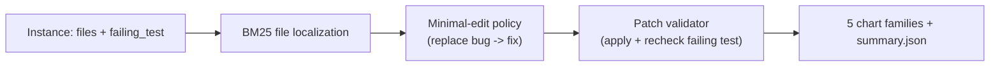

# swe-bench-agent

> SWE-Bench-Lite focused agent: BM25-based file localization, minimal-edit policy, single-pass patch validator. Synthetic in-memory fixture so the full pipeline runs hermetically in CI.
> Last updated: 2024-12-05.

`swe-bench-agent` is a minimal-edit patch-generation agent in the spirit of SWE-Bench-Lite. The agent has access to the repo file tree, picks the file most likely to contain the bug via BM25, swaps the bug token for the fix token, and the validator re-applies the patch and re-runs the failing test. A "confused" baseline policy is included to verify the validator actually rejects bad patches.

## Headline (synthetic fixture, n=30)

| metric | minimal-edit | confused |
|---|---|---|
| pass rate | 1.00 | 0.00 |
| edited files per instance | 1 | 1 |
| chars changed per instance | < 10 | > 0 (but wrong file) |

Reproduce: `make install && make bench`.

## Pipeline



## Five chart families

- `results/figures/per_repo_success.png` - success rate per repo
- `results/figures/chars_changed.png` - minimal-edit footprint
- `results/figures/edited_files.png` - files edited per instance
- `results/figures/per_instance.png` - per-instance pass/fail strip
- `results/figures/repo_outcome.png` - repo x outcome heatmap

## Repo layout

```
src/sba/
  types.py            # Instance, Patch, RunOutcome
  tasks/synthetic.py  # 30-instance, 3-repo fixture
  agent/policy.py     # minimal-edit + confused
  validator/check.py  # apply patch + verify failing test
  viz/charts.py
  cli/main.py         # `sba bench`
  runner.py
tests/                # 9 tests, all green
docs/research_report.pdf
docs/_report/, docs/test_results/, results/figures/
CITATION.cff, LICENSE, Makefile, .github/workflows/ci.yml
```

## Quick start

```bash
make install
make test
make bench
make pdf
```

## Documentation

[`docs/research_report.pdf`](./docs/research_report.pdf) (15 pages).
Test artifacts in [`docs/test_results/`](./docs/test_results/).

## References

- Jimenez et al. "SWE-bench: Can Language Models Resolve Real-World GitHub Issues?" (2024)
- Aider, Devin, OpenDevin systems.

## License

MIT.
