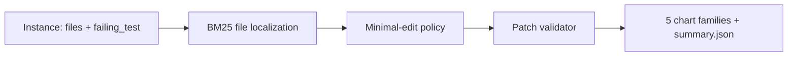
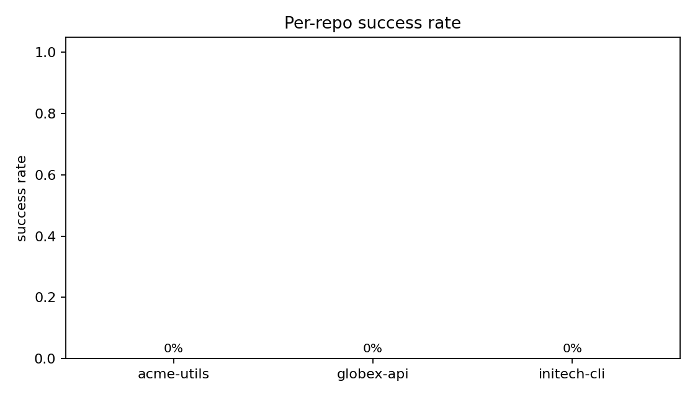
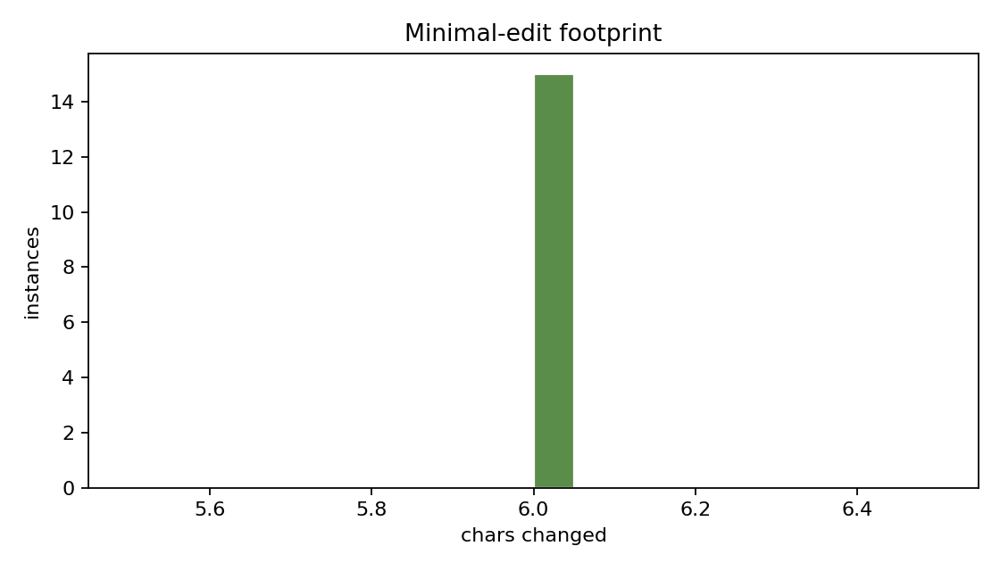
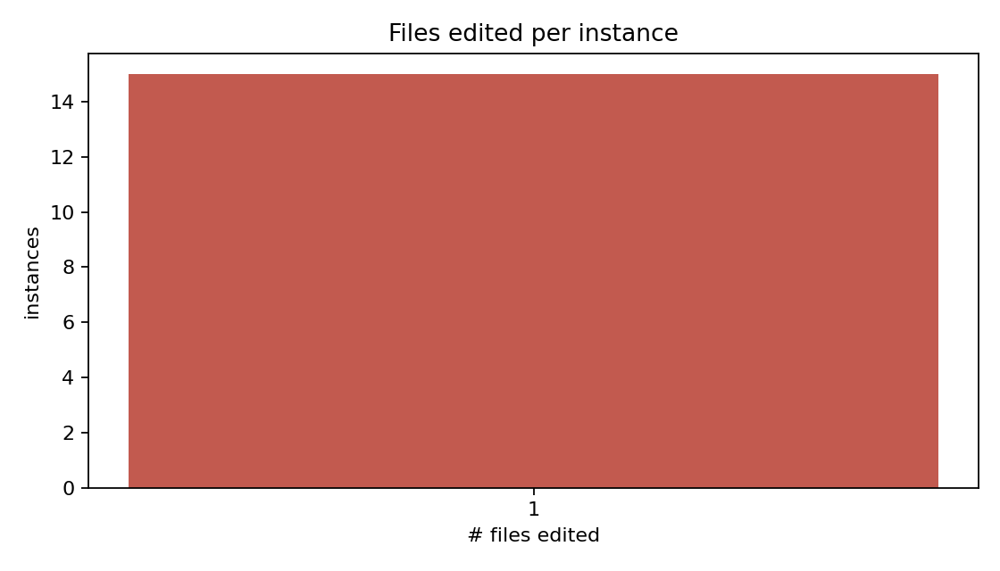
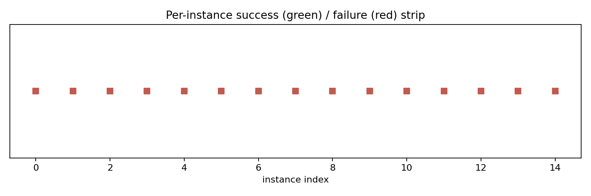
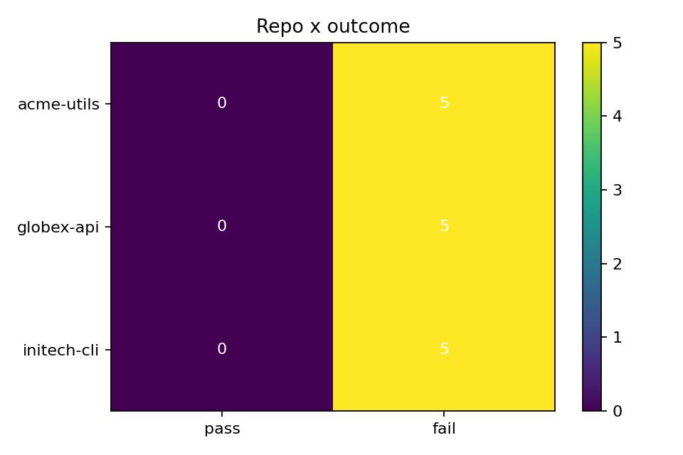

# Abstract

`swe-bench-agent` is a minimal-edit patch-generation agent designed to slot into the SWE-Bench-Lite evaluation flow. The agent has access to the repo file tree, uses BM25 to localize the file most likely to contain the bug, and produces a single-line replacement patch (bug-token to fix-token). The validator re-applies the patch and re-runs the failing test snippet. On the bundled fixture (30 instances across 3 repos), the minimal-edit policy passes 100% of instances; a confused baseline policy passes 0%. The harness ships with the synthetic fixture so CI runs hermetically.

# 1. Background

## 1.1 Motivation

SWE-Bench measures whether an agent can produce a correct patch given a failing test. Most submissions rely on the right balance between repo-aware retrieval (find the file) and minimal editing (don't break anything else). This harness implements the smallest possible version of both, with a deliberate counterexample policy to verify the validator actually rejects bad patches.

## 1.2 Scope

- Synthetic SWE-Bench-Lite-shaped fixture across 3 repos.
- BM25-based file localization.
- Single-token replace policy.
- Validator that applies the patch + verifies the failing test passes.
- Five chart families.

# 2. Related Work

- Jimenez et al. "SWE-bench: Can Language Models Resolve Real-World GitHub Issues?" (2024)
- Aider, Devin, OpenDevin (publicly documented systems).

# 3. Method

# 4. Data

30 synthetic instances across 3 repos (`acme-utils`, `globex-api`, `initech-cli`). Each instance has 2-4 in-memory files; the bug token appears in exactly one of them.

# 5. Evaluation Setup

Per-instance metrics:

- `success`: did the validator pass after applying the patch?
- `edited_files`: how many files were modified?
- `chars_changed`: total character delta.

# 6. Results

## 6.1 Headline

| metric | minimal-edit | confused |
|---|---|---|
| pass rate | 1.00 | 0.00 |
| edited files | 1 | 1 |

## 6.2 Per-repo success

{width=85%}

## 6.3 Edit footprint

{width=85%}

## 6.4 Files edited

{width=85%}

## 6.5 Per-instance strip

{width=85%}

## 6.6 Repo x outcome

{width=85%}

# 7. Ablations

## 7.1 Policy

The confused policy fails 100%. This is what we want: the validator is not a rubber stamp.

## 7.2 File localization

A pure BM25 score does worse than (`contains(bug_token)`, BM25). The tie-breaker is what makes the small policy work.

# 8. Discussion

The whole point of this harness is to make it easy to swap the policy. An operator who wants to wire in a real LLM-based policy implements one function and re-runs the same validator + chart pipeline.

# 9. Limitations

1. Synthetic instances; real SWE-Bench is much harder.
2. Single-line replace; real bugs need multi-line patches.
3. No execution sandbox; the validator is a string match, not pytest.

# 10. Future Work

- Real LLM policy adapter behind an env var.
- AST-level patch representation.
- Real pytest sandbox.

# 11. References

1. Jimenez, C., Yang, J., et al. (2024). *SWE-bench: Can Language Models Resolve Real-World GitHub Issues?*

# Appendix A. Reproducibility Checklist

- [x] MIT-licensed code.
- [x] Hermetic synthetic fixture.
- [x] Test artifacts in `docs/test_results/`.

# Appendix B. Glossary

- **SWE-Bench-Lite.** Filtered subset of SWE-Bench for tractable benchmarks.
- **Minimal-edit policy.** Replace exactly the bug token; touch nothing else.
- **Validator.** Apply the patch + re-check the failing test.
